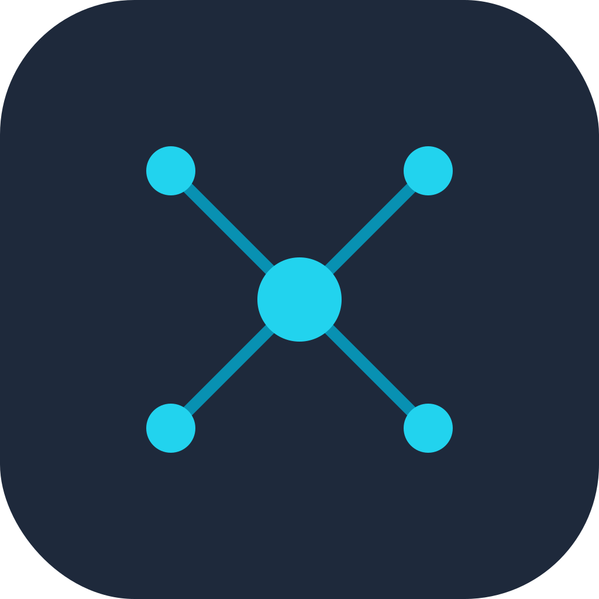
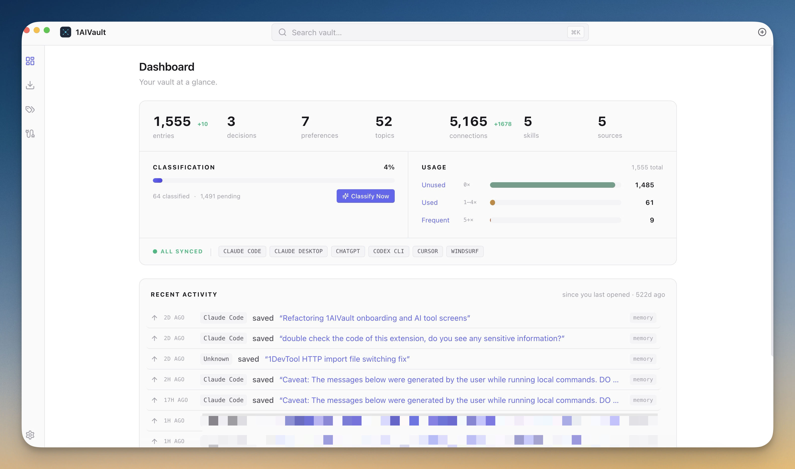
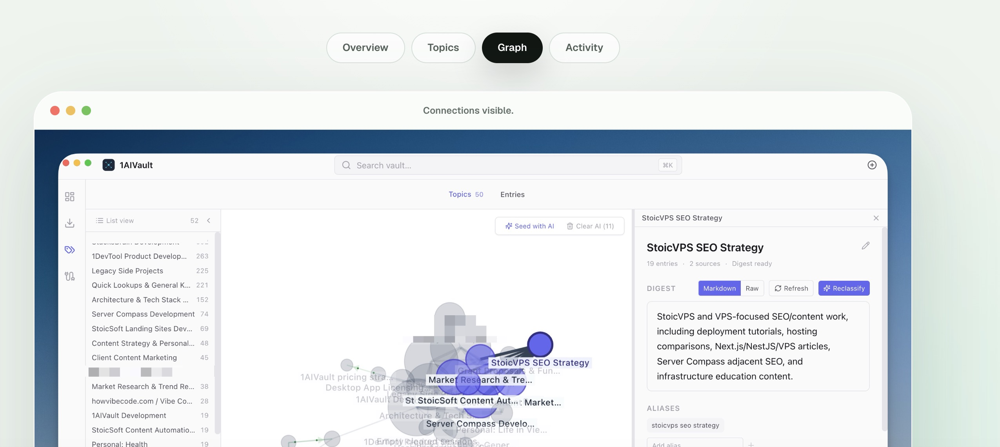

<!--
  Connector repo for directory listings (mcp.so, Glama, PulseMCP, Smithery, awesome-mcp-servers).
  This repo is DOCS ONLY — it does not contain the server source. The MCP server ships inside the
  1AIVault desktop app. If your GitHub org/name differs, replace `stoicsoft/1aivault-mcp` throughout.
-->

<p align="center">
  
</p>

<h1 align="center">1AIVault — MCP Server</h1>

<p align="center"><strong>Your portable AI memory vault — memories, skills &amp; configs, shared across every AI tool.</strong></p>

<p align="center">
  
  
  
  
  
  
</p>

1AIVault is a local-first desktop app that acts as a **portable memory vault for AI tools**. It stores your
memories, decisions, preferences, and reusable skills in a local SQLite database and exposes them to your AI
clients through this **Model Context Protocol (MCP)** server — so what you tell Claude Desktop is available in
Cursor, Claude Code, Cline, and more. No cloud, no account, no data leaving your machine.

> **Website & download:** **https://1aivault.com**

<p align="center">
  
</p>

---

## Why

Every AI tool has its own memory silo. Context you build up in one is invisible to the next. 1AIVault gives you
**one vault** that all your AI clients read and write through a single MCP server — a shared, portable brain you
own, stored on your own disk.

- 🧠 **Cross-tool memory** — save in Claude Desktop, recall in Cursor
- 🔒 **Local-first** — a single SQLite DB at `~/.1aivault/vault.db`, WAL mode, never uploaded
- 🕸️ **Knowledge graph** — link entries, traverse related context, auto-extract topics across sources
- 🧩 **Reusable skills** — save AI instructions once, load them by name anywhere
- ⚡ **Zero-config install** — the app writes the MCP config for each client in one click

<p align="center">
  
</p>

---

## Install

1AIVault is a desktop app that **bundles** this MCP server — there is nothing to `npx` or clone.

1. **Download** the app for your OS from **https://1aivault.com** (macOS · Windows · Linux)
2. **Open** 1AIVault
3. Go to **Connect** and click **Install** next to your AI client — 1AIVault writes the MCP config automatically

### Supported AI clients

| Client | Auto-install |
|---|:---:|
| Claude Desktop | ✅ |
| Claude Code | ✅ |
| Cursor | ✅ |
| Cline (VS Code) | ✅ |
| Codex CLI | ✅ |
| Gemini CLI | ✅ |
| OpenCode | ✅ |
| Antigravity CLI | ✅ |
| ChatGPT Desktop | ✅ |

Any MCP-compatible client that supports **stdio** servers can also be pointed at it manually
(see [How it works](#how-it-works)).

---

## Tools

The server exposes **20 tools** over stdio. Your AI client calls them automatically as you work.

| Tool | What it does |
|---|---|
| `vault_save` | Save a memory, decision, preference, or fact to the persistent vault |
| `vault_search` | Full-text search the vault — supports `"quoted phrases"`, `-exclude`, `tag:`, `tier:`, `category:` |
| `vault_recent` | List recently saved entries, chronologically |
| `vault_by_tag` | Fetch entries by tag |
| `vault_update` | Edit or rename an existing entry |
| `vault_tags` | List all tags with counts |
| `vault_get` | Fetch one entry by ID (full content) |
| `vault_save_conversation` | Archive the current conversation as a summary + full text |
| `vault_load_skill` | Load a user-defined skill (reusable AI instructions) by name |
| `vault_list_skills` | List saved skills (name + description) |
| `vault_link` | Link two entries with a named relationship (knowledge-graph edge) |
| `vault_related` | Walk the knowledge graph from an entry (up to 3 hops) |
| `vault_brain_query` | Keyword search **+** graph traversal to surface richer connected context |
| `vault_extract_insights` | Run auto-linking / pattern extraction over entries |
| `vault_classify_pending` | Fetch entries not yet classified into topics |
| `vault_save_classifications` | Assign entries to cross-source topics (and update digests) |
| `vault_list_topics` | List cross-source topics with entry counts and digest previews |
| `vault_topic_digest` | Get a topic's cross-source summary, aliases, and entries |
| `vault_search_topics` | Full-text search across topics |
| `vault_link_topics` | Declare typed relationships between topics |

---

## How it works

Three processes share **one** SQLite database (`~/.1aivault/vault.db`, WAL mode) — no HTTP bridge, WAL handles
cross-process concurrency:

```
Main (Electron) ─┐                                ┌─ MCP server subprocesses
                 ├── ~/.1aivault/vault.db (WAL) ──┤   (spawned by Claude Desktop,
Renderer (UI) ───┘                                └─   Cursor, Claude Code, Cline, …)
```

Each AI client spawns its own copy of the MCP server as a stdio subprocess. On a packaged install, the server
runs through the app's own runtime (so it shares the exact native-module ABI shipped with the app), and 1AIVault
writes a config like this for you — you don't edit it by hand:

<details>
<summary>Example generated config (macOS)</summary>

```json
{
  "mcpServers": {
    "1aivault": {
      "command": "/Applications/1AIVault.app/Contents/MacOS/1AIVault",
      "args": [
        ".../app.asar.unpacked/dist/main/main/mcp/server.js",
        "--source", "claude_desktop",
        "--db", "/Users/you/.1aivault/vault.db"
      ],
      "env": {
        "ELECTRON_RUN_AS_NODE": "1",
        "NODE_PATH": ".../app.asar.unpacked/node_modules"
      }
    }
  }
}
```

Paths are resolved per-machine by the app. The `--source` tag records which client wrote an entry; `--db`
points at your vault.
</details>

---

## Privacy

- **100% local.** Your vault is a file on your disk. Nothing is sent to any server by the MCP layer.
- **You own the data.** Curate, export, and move it between machines from the desktop app.
- **No account required** to use the vault or the MCP server.

---

## Links

- 🌐 Website & download — https://1aivault.com
- 🏢 Made by [StoicSoft](https://stoicsoft.com)
- 📨 Support — hello@stoicsoft.com

---

<sub>1AIVault is commercial software. This repository is documentation for the bundled MCP server; the app source
is not open source. © StoicSoft.</sub>
